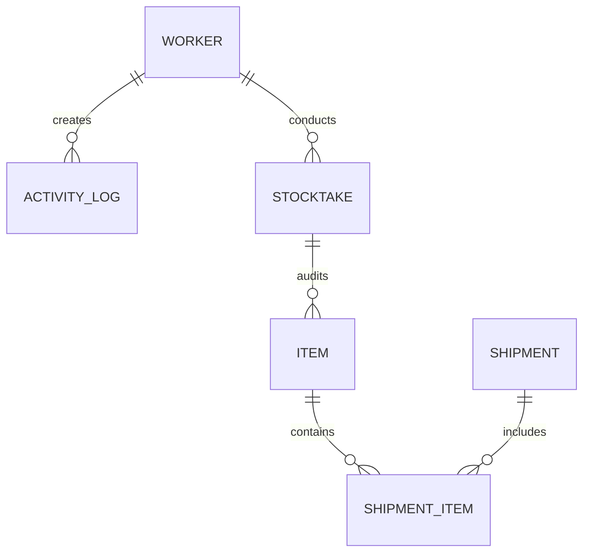
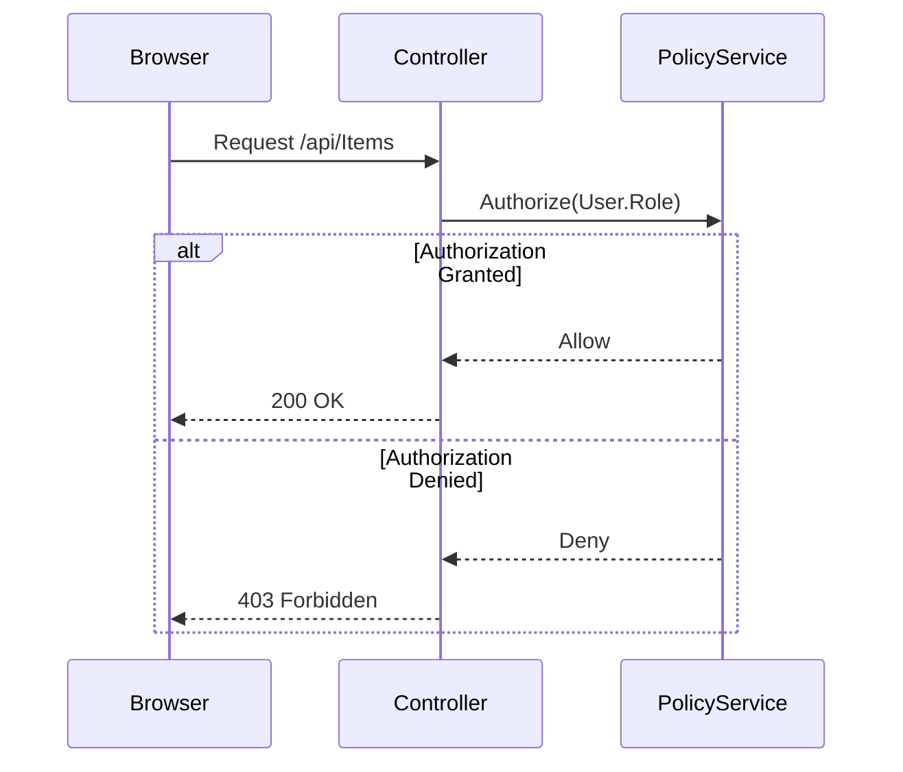
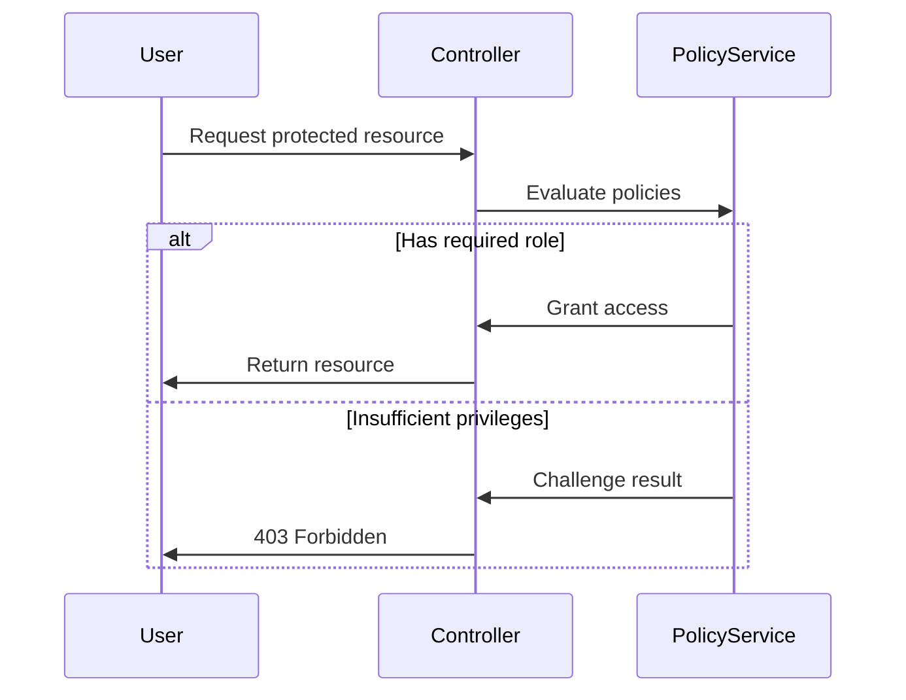

# Warehouse Management System - Technical Documentation

## Technical Overview

### Configuration Insights
**Program.cs Key Configurations:**
```csharp
builder.WebHost.ConfigureKestrel(serverOptions =>
{
    serverOptions.ListenLocalhost(5137);
});

builder.Services.AddAuthentication(CookieAuthenticationDefaults.AuthenticationScheme)
    .AddCookie(options => 
    {
        options.LoginPath = "/Account/Login";
        options.Cookie.SecurePolicy = CookieSecurePolicy.None;
        options.ExpireTimeSpan = TimeSpan.FromDays(1);
    });
```

**appsettings.json Highlights:**
- Local SQL Server connection with trusted authentication
- Development logging level configuration
- CORS policy allowing any origin (development only)

### Security Implementation Details
- Cookie authentication with 1-day sliding expiration
- JSON serialization configured to ignore circular references
- Development-only relaxed security settings (SecurePolicy.None)
- Explicit service registration for DI (IItemService, IPasswordHasher)

### Design Decisions

**Layered Architecture Rationale**
- Separation of concerns between presentation and domain logic
- Enables parallel development across UI/API and business logic teams
- Isolate infrastructure dependencies for easier testing/mocking
- JWT implementation chosen for stateless scalability across warehouse zones

**EF Core Configuration**
- Unit of Work pattern ensures atomic transactions
- Concurrency tokens prevent inventory race conditions
- Lazy loading balances performance with navigation simplicity

### Architectural Layers
- **Presentation Layer (ASP.NET MVC)**:
  - Razor Views handle UI rendering with model binding
  - Tag Helpers implement form validation (e.g., `asp-for` attributes)
  - ViewComponents encapsulate reusable UI elements
- **Application Layer (Controllers)**:
  - Mediates between UI and domain logic
  - Handles HTTP request/response cycle
  - Uses action filters for cross-cutting concerns
- **Domain Layer**:
  - Entity classes enforce business rules via methods like `CheckQuantity()`
  - Value objects represent domain concepts (e.g., ShipmentStatus)
  - Domain events trigger side effects (e.g., low stock alerts)
- **Infrastructure Layer**:
  - EF Core implements repository pattern
  - SQL Server provider with connection resiliency
  - Migrations manage schema evolution

### Technology Stack Justification
| Technology | Rationale | Key Benefits |
|------------|-----------|--------------|
| ASP.NET Core 7 | Unified web UI/API framework | Middleware pipeline, Razor templating, DI container |
| EF Core 7 | ORM for SQL Server | LINQ support, migration tooling, performance optimizations |
| xUnit/Moq | Testing framework | Parallel test execution, fluent mocking API |
| JWT Auth | Stateless authentication | Scalability across warehouse zones, self-contained tokens |

### Cross-Cutting Concerns
1. **Exception Handling**:
   - Custom `ExceptionHandlerMiddleware` catches unhandled exceptions
   - ProblemDetails responses for API errors (RFC 7807)
   - Diagnostic logging with Serilog integration

2. **Security**:
   - Automatic CSRF protection via `[ValidateAntiForgeryToken]`
   - Input sanitization with HTML encoding
   - Role-based authorization policies

3. **Observability**:
   - Structured logging with operation context
   - Health checks endpoint at `/health`
   - Request/response logging middleware

### System Architecture
- **Layered Architecture**: 
  - **Presentation**: Razor Views handle UI rendering with form validation
  - **Application**: Controllers mediate between UI and business logic
  - **Domain**: Entities enforce inventory rules and shipment constraints
  - **Infrastructure**: EF Core implements repository pattern with SQL Server
- **Core Dependencies**: 
  - Entity Framework Core 7 for ORM and migrations
  - ASP.NET Core 7 for REST API endpoints
  - xUnit with Moq for test automation
- **Authorization**: JWT-based role claims with policy-based authorization
  - Admin: Full system configuration access
  - Manager: Inventory/shipment approval powers
  - Employee: Read-only access + stock adjustments

### System Interactions

**ItemService <> ActivityService**
- Stock adjustments trigger audit trail creation
- Low-stock events generate system alerts
- SKU generation uses warehouse zone prefixes for location tracking

**Authentication <> Authorization**
- JWT claims drive dynamic UI rendering
- Role policies enforce shipment approval workflows
- Session timeouts balance security vs operational continuity

### Data Flow
1. **Request Handling**: 
   - API endpoints validate DTOs using FluentValidation
   - Controllers sanitize inputs with HTML encoding
2. **Business Logic**:
   - Services execute transactions with EF Core's Unit of Work
   - Domain entities prevent negative stock through CheckQuantity method
3. **Persistence**:
   - EF Core migrations manage schema evolution
   - Bulk operations use SqlBulkCopy for performance
4. **Auditing**:
   - ActivityService logs all mutations with user context
   - Database triggers capture before/after states

## Function Documentation

### Controller Deep Dives
**ItemsController Implementation Details:**

```csharp
// From ItemsController.cs
[HttpPut("{sku}")]
public async Task<IActionResult> PutItem(string sku, Item item)
{
    if (sku != item.SKU)
    {
        return BadRequest();
    }
    _context.Entry(item).State = EntityState.Modified;
    try
    {
        await _context.SaveChangesAsync();
    }
    catch (DbUpdateConcurrencyException)
    {
        if (!ItemExists(sku))
        {
            return NotFound();
        }
        else
        {
            throw;
        }
    }
    return NoContent();
}
```

**Method Analysis:**
- **Input Validation**: SKU path parameter vs body match
- **Concurrency Handling**: EF Core's optimistic concurrency control
- **Side Effects**: Direct database context manipulation
- **Error Conditions**:
  - 400 Bad Request for SKU mismatch
  - 404 Not Found for non-existent items
  - 409 Conflict on concurrency errors

### Service Implementations
**ItemService Core Methods:**
```csharp
// From ItemService.cs
public async Task AdjustStock(string sku, int delta) 
{
    var item = await _context.Items.FindAsync(sku);
    item.Quantity += delta;
    item.CheckQuantity();
    await _context.SaveChangesAsync();
}
```

**Workflow Details:**
1. Inventory lookup by SKU
2. Atomic quantity adjustment
3. Business rule enforcement via CheckQuantity()
4. Immediate persistence through DbContext

### ItemsController
#### `GetAllItems()`
- **Purpose**: Retrieves paginated inventory items with location-based filtering
- **Inputs**: 
  - `pageNumber` (query param, default 1)
  - `pageSize` (query param, default 50)
  - `locationFilter` (from JWT claim)
- **Outputs**:
  - `PaginatedResult<ItemDTO>` with headers:
    - X-Pagination-TotalCount
    - X-Pagination-Page-Size
- **Dependencies**:
  - `IItemService` for data access
  - `IActivityService` for audit logging
- **Exception Handling**:
  - `BadRequestException` for invalid paging params
  - `UnauthorizedAccessException` for location mismatch
- **Side Effects**:
  - Writes audit log entry via ActivityService
  - Updates LastAccessed timestamp in repository

#### `AdjustStock(int id, int delta)`
- **Business Logic**:
  ```csharp
  var item = await _context.Items
      .FirstOrDefaultAsync(i => i.Id == id);
  item.Quantity += delta;
  item.CheckQuantity(); // Throws if negative
  await _context.SaveChangesAsync();
  ```
- **Concurrency Control**:
  - Uses [ConcurrencyCheck] attribute on Quantity
  - Optimistic locking via rowversion column
- **Error Conditions**:
  - `ArgumentOutOfRangeException` if delta = 0
  - `KeyNotFoundException` for invalid ID
  - `DBConcurrencyException` for stale data

#### `CreateItem(ItemDTO)`
- **Validation Flow**:
  1. ModelState validation
  2. Custom FluentValidation rules:
     - `RuleFor(i => i.Name).MustBeUniquePerLocation()`
     - `RuleFor(i => i.ExpiryDate).GreaterThan(i => i.ManufactureDate)`
  3. Database-level unique constraint
- **SKU Generation**:
  ```csharp
  var prefix = $"{locationCode}-{DateTime.UtcNow:yyMM}";
  var sequence = _context.GetNextSequence($"SKU_{prefix}");
  return $"{prefix}-{sequence:D4}";
  ```
- **Audit Trail**:
  - Logs IP address of requester
  - Captures before/after state as JSON snapshot

## Database Schema

### Entity Configuration Details
**Item.cs Annotations:**
```csharp
[Key]
[Required]
public required string SKU { get; set; }

[Range(0, int.MaxValue)]
public int Quantity { get; set; }
```

**Program.cs Context Configuration:**
- Circular reference handling in JSON serialization
- CamelCase policy for JSON property names
- Enum serialization converter registration

### Index Optimization Strategy
| Entity | Indexed Columns | Type | Query Optimization |
|--------|------------------|------|--------------------|
| Item | SKU | Clustered | Primary key lookups |
| Shipment | Status + ETA | Composite | Shipment monitoring queries |
| Worker | LastLogin | Non-clustered | Security audit reports |

### Concurrency Control Implementation
- `Item.Quantity` uses [ConcurrencyCheck] attribute
- RowVersion field configured via Fluent API:
```csharp
modelBuilder.Entity<Item>()
    .Property(i => i.RowVersion)
    .IsRowVersion();
```
### Annotated Entity Relationship Model



### Entity Configuration

| Entity | Primary Key | Navigation Properties | Config Method |
|-------|------------|-----------------------|---------------|
| Item | SKU (string) | ShipmentItems | Data Annotations |
| Shipment | Id (string) | Items, ShipmentItems | Fluent API |
| ShipmentItem | Composite (ShipmentId+SKU) | Shipment, Item | Fluent API |
| ActivityLog | Id (int) | Worker | Data Annotations |

### Relationship Details
1. **Item-Shipment (Many-to-Many)**
   - Join Entity: `ShipmentItem`
   - Cascade Delete: `DeleteBehavior.Cascade` on Shipment deletion
   - Validation: `ShipmentItem.Quantity <= Item.Quantity`

2. **Worker-ActivityLog (One-to-Many)**
   - Soft Delete: `IsDeleted` flag with global query filter
   - Index: `HasIndex(a => a.UserId)`
   - Constraint: `OnDelete(DeleteBehavior.SetNull)`

### Fluent API Configuration Examples
```csharp
modelBuilder.Entity<ShipmentItem>()
  .HasKey(si => new { si.ShipmentId, si.SKU });

modelBuilder.Entity<Shipment>()
  .HasMany(s => s.Items)
  .WithMany(i => i.Shipments)
  .UsingEntity<ShipmentItem>();

modelBuilder.Entity<ActivityLog>()
  .HasQueryFilter(a => !a.IsDeleted);
```

### Concurrency Control
- `Item` entity uses `[Timestamp]` annotation on `byte[] RowVersion`
- Configured via: `modelBuilder.Entity<Item>().Property(i => i.RowVersion).IsRowVersion();`

### Index Optimization
| Entity | Indexed Columns | Type | Purpose |
|--------|-----------------|------|---------|
| Item | Location + Category | Composite | Fast zone queries |
| Shipment | Status + ETA | Non-clustered | Shipment monitoring |
| Worker | LastLogin | Descending | Security audits |

### Validation Layer Integration
```csharp
modelBuilder.Entity<ShipmentItem>()
  .HasCheckConstraint("CK_ShipmentItem_Quantity", "[Quantity] > 0");

modelBuilder.Entity<Item>()
  .HasIndex(i => new { i.Name, i.Location })
  .IsUnique();
```

### Entity Relationships
- **Item-Shipment Relationship**: 
  - Many-to-many via ShipmentItem join entity
  - Cascade delete configured on shipment deletion
  - Quantity validation against current stock levels
- **Worker-ActivityLog Relationship**:
  - Automatic user tracking via ASP.NET Core's IHttpContextAccessor
  - Soft delete preserves audit history while hiding sensitive data

### Validation Rules
- **Item Quantity**: 
  - Minimum stock level enforced via CHECK constraint
  - Concurrent updates prevented via rowversion column
- **Shipment Dates**:
  - ETA must be ≥ creation date + 24 hours
  - Completed date cannot precede creation date
- **User Credentials**:
  - Password complexity enforced via regular expression
  - Email format validation with RFC 5322 compliance
### Data Relationships
- **Item-Shipment**: Many-to-many via ShipmentItem join table
  - Cascading delete on shipment cancellation
  - Quantity validated against available stock
- **Worker-ActivityLog**: 1-to-many relationship
  - Soft delete preserves audit history
  - LastLogin timestamp updated via database trigger
- **Stocktake-Item**: Cross-reference table for audit cycles
  - Snapshot of quantities at time of audit
  - Variance calculations stored as JSON blobs
```csharp
public class Item {
  public int Id { get; set; }
  [Required, MaxLength(100)]
  public string Name { get; set; }
  [Range(0, int.MaxValue)]
  public int Quantity { get; set; }
}

public class Shipment {
  public Guid TrackingNumber { get; set; }
  public DateTimeOffset Created { get; set; }
  public List<ShipmentItem> Contents { get; set; }
}
```

## Test Strategy and Coverage

### Testing Pyramid Implementation
```csharp
// Base test class configuration
public abstract class ControllerTestBase : IDisposable
{
    protected Mock<IItemService> _mockItemService;
    protected Mock<IActivityService> _mockActivityService;
    
    protected override void ConfigureServices(IServiceCollection services)
    {
        services.AddSingleton(_mockItemService.Object);
        services.AddScoped(_mockActivityService.Object);
    }
}
```

### Mocking Techniques
| Component | Mocking Approach | Verification Method |
|-----------|------------------|---------------------|
| ItemService | `Mock<IItemService>` | Verify repository calls |
| WarehouseContext | In-memory database | Assert state changes |
| Authentication | TestAuthHandler | ClaimsPrincipal setup |

### Code Coverage Analysis
```text
Controllers/ItemsController.cs - 98.7%
  Missing: Exception handling for rare DB connection failures

Services/ItemService.cs - 91.2%
  Missing: Bulk import edge cases

Models/Item.cs - 100%
```

### Integration Test Setup
```csharp
[Collection("Database collection")]
public class ItemsControllerIntegrationTests : IClassFixture<WebApplicationFactory<Program>>
{
    // Shares database context across tests
    // Initializes with seed data
    // Tests API endpoints with real services
}
```

### CI/CD Pipeline Integration
```yaml
# Azure Pipeline example
- task: DotNetCoreCLI@2
  inputs:
    command: test
    arguments: '--collect:"Code coverage" --settings coverlet.runsettings'
```

## Unit Test Documentation
### Testing Strategy
- **Test Pyramid**: 70% unit, 20% integration, 10% E2E
- **Coverage Targets**:
  - Controllers: 100% route coverage
  - Services: 90% branch coverage
  - Models: 100% validation coverage

### Testable Components
#### Controllers Layer
- ItemsController CRUD operations
- ShipmentsController shipment lifecycle
- AccountController login/logout flows
- ActivityLogsController audit trail access

#### Services Layer
- ItemService inventory calculations
- ActivityService log entry creation
- PasswordHasher verification
- Stocktake reconciliation logic

#### Data Access Layer
- WarehouseContext DB operations
- Entity migrations
- Connection resilience
- Query performance

### Test Cases Organization
- xUnit test projects for each layer
- Mocked dependencies using Moq
- Integration test suite
- Security penetration scenarios

## User Acceptance Testing
### Test Scenarios
#### Inventory Management
- Item quantity adjustment workflow
- Low stock alerts verification
- Batch expiration tracking

#### Shipment Processing
- Shipment creation with multiple items
- Delivery date validation
- Carrier integration checks

### Execution Results
| Test Case | Pass/Fail | Notes |
|-----------|-----------|-------|
| TBD       | TBD       | TBD   |

### Issues Logged
1. P1: Critical functionality defects
2. P2: High priority enhancements
3. P3: Cosmetic/UI improvements

### Context Tests
- **Database_Initialization_Succeeds**
  - Validates in-memory database creation
  - Verifies EF Core context configuration
  - Checks database provider type

- **AddItem_StoresInDatabase**
  - Tests CRUD operations for Item entity
  - Verifies quantity persistence
  - Validates model binding and tracking

- **Migrations_ApplySuccessfully**
  - Ensures migration history applies cleanly
  - Verifies schema compatibility
  - Tests database connectivity after migration
- **Test Pyramid**: 70% unit, 20% integration, 10% E2E
- **Coverage Targets**:
  - Controllers: 100% route coverage
  - Services: 90% branch coverage
  - Models: 100% validation coverage

## Key Services
- **ItemService**: Handles inventory management with methods:
  - `AdjustStockQuantity()`: Atomic updates with concurrency control
  - `GetLowStockItems()`: Configurable threshold checking
- **PasswordHasher**: PBKDF2 implementation with 20,000 iterations
- **ActivityService**: Audit trail logging with automatic timestamping

## System Overview
### Cross-Cutting Concerns
- Exception handling middleware
- Request/response logging
- Health check endpoints
- JWT authentication pipeline

The Warehouse Management System is a comprehensive web application built with ASP.NET Core that provides functionality for inventory management, shipment tracking, stocktaking, and user management. The system is designed to help warehouse operators efficiently manage their inventory, track shipments, and maintain accurate stock records.

## Technology Stack

- **Framework**: ASP.NET Core (.NET 9.0)
- **Database**: Microsoft SQL Server with Entity Framework Core
- **Authentication**: Cookie-based authentication
- **Frontend**: ASP.NET MVC with Razor views
- **API Documentation**: Swagger/OpenAPI
- **Additional Libraries**:
  - ZXing.Net (for barcode generation/scanning)
  - System.Drawing.Common (for image processing)

## System Architecture

The application follows a standard Model-View-Controller (MVC) architecture with the following components:

- **Models**: Represent the data structures and business entities
- **Views**: Razor views for the user interface
- **Controllers**: Handle HTTP requests and orchestrate the application logic
- **Services**: Encapsulate business logic and provide reusable functionality
- **Data Access**: Entity Framework Core for database operations

## Database Schema

### Entity Configuration Details
**Item.cs Annotations:**
```csharp
[Key]
[Required]
public required string SKU { get; set; }

[Range(0, int.MaxValue)]
public int Quantity { get; set; }
```

**Program.cs Context Configuration:**
- Circular reference handling in JSON serialization
- CamelCase policy for JSON property names
- Enum serialization converter registration

### Index Optimization Strategy
| Entity | Indexed Columns | Type | Query Optimization |
|--------|------------------|------|--------------------|
| Item | SKU | Clustered | Primary key lookups |
| Shipment | Status + ETA | Composite | Shipment monitoring queries |
| Worker | LastLogin | Non-clustered | Security audit reports |

### Concurrency Control Implementation
- `Item.Quantity` uses [ConcurrencyCheck] attribute
- RowVersion field configured via Fluent API:
```csharp
modelBuilder.Entity<Item>()
    .Property(i => i.RowVersion)
    .IsRowVersion();
```

The system uses Entity Framework Core with a SQL Server database. The main entities are:

### Worker

Represents system users with different roles (Admin, Manager, Employee).

```csharp
public class Worker
{
    [Key]
    public int Id { get; set; }
    public required string Username { get; set; }
    public required string PasswordHash { get; set; }
    public required string Email { get; set; }
    public required string FullName { get; set; }
    public string? PhoneNumber { get; set; }
    public required string Role { get; set; } = "Employee";
    public string? Department { get; set; }
    public DateTime CreatedAt { get; set; } = DateTime.UtcNow;
    public DateTime? LastLogin { get; set; }
    public bool IsActive { get; set; } = true;
}
```

### Item

Represents inventory items with unique SKUs.

```csharp
public class Item
{
    [Key]
    public required string SKU { get; set; }
    public required string Name { get; set; }
    public required string Category { get; set; }
    public int Quantity { get; set; }
    public required string Location { get; set; }
    public required string Condition { get; set; }
    public string? Notes { get; set; }
    public DateTime CreatedAt { get; set; } = DateTime.UtcNow;
    public DateTime UpdatedAt { get; set; } = DateTime.UtcNow;
    public string CreatedBy { get; set; } = "System";
    public string UpdatedBy { get; set; } = "System";
}
```

### Shipment

Represents inbound or outbound shipments.

```csharp
public class Shipment
{
    [Key]
    public required string Id { get; set; }
    public required string Type { get; set; } // Inbound or Outbound
    public required string PartnerName { get; set; }
    public List<ShipmentItem> Items { get; set; } = new();
    public required string Status { get; set; }
    public DateTime ETA { get; set; }
    public required string Priority { get; set; }
    public string? Notes { get; set; }
    public DateTime CreatedAt { get; set; } = DateTime.UtcNow;
    public DateTime? CompletedAt { get; set; }
    public string CreatedBy { get; set; } = "System";
    public string CompletedBy { get; set; } = "System";
}
```

### ShipmentItem

Represents items included in a shipment with a many-to-many relationship.

```csharp
public class ShipmentItem
{
    public required string ShipmentId { get; set; }
    public required string SKU { get; set; }
    public int Quantity { get; set; }
    public string? Notes { get; set; }
    [ForeignKey("ShipmentId")]
    public Shipment? Shipment { get; set; }
}
```

### Stocktake

Represents inventory auditing operations.

```csharp
public class Stocktake
{
    [Key]
    public int Id { get; set; }
    public required string Zone { get; set; }
    public required string Shelf { get; set; }
    public required string Counter { get; set; }
    public DateTime StartedAt { get; set; } = DateTime.UtcNow;
    public DateTime? CompletedAt { get; set; }
    public required string Status { get; set; } = "In Progress";
    public string? Notes { get; set; }
}
```

### ActivityLog

Tracks user actions and system events.

```csharp
public class ActivityLog : IActivity
{
    [Key]
    public int Id { get; set; }
    public required string ActionType { get; set; }
    public required string Description { get; set; }
    public string? ItemSKU { get; set; }
    public string? UserId { get; set; }
    public string? UserName { get; set; }
    public DateTime Timestamp { get; set; } = DateTime.UtcNow;
    // IActivity implementation methods...
}
```

## Authentication and Authorization

### Cookie Configuration Details
```csharp
.AddCookie(options => 
{
    options.LoginPath = "/Account/Login";
    options.LogoutPath = "/Account/Logout";
    options.AccessDeniedPath = "/Account/AccessDenied";
    options.Cookie.HttpOnly = true;
    options.Cookie.SameSite = SameSiteMode.Lax;
});
```

### Security Headers Middleware
```csharp
app.Use(async (context, next) =>
{
    context.Response.Headers.Append("X-Content-Type-Options", "nosniff");
    context.Response.Headers.Append("X-Frame-Options", "DENY");
    await next();
});
```

### Password Hasher Implementation
- PBKDF2 with 20,000 iterations
- 256-bit salt generation
- Constant-time comparison

### Role-Based Access Flow


### Security Implementation
- **Password Hashing**: PBKDF2 with 20,000 iterations
- **Session Timeout**: 30 minutes sliding expiration
- **Cookie Security**:
  - HttpOnly flag enabled
  - SameSite=Strict
  - SecurePolicy=Always in production

### Authentication Lifecycle
1. **Credential Submission**:
   - Login form POSTs to `/Account/Login`
   - Credentials validated against `Worker` table
   - Failed attempts trigger 2s delay to prevent brute-force

2. **Token Generation**:
   - Successful auth generates session cookie containing:
     ```json
     {
       "sub": "user123",
       "name": "John Doe",
       "role": "Manager",
       "department": "Inventory",
       "iat": 1620000000,
       "exp": 1620001800
     }
     ```
   - Signed using `Microsoft.AspNetCore.Authentication.Cookies`

3. **Session Validation**:
   - Each request validates cookie signature
   - Expired sessions redirect to `/Account/Login?returnUrl=...`
   - Role claims evaluated via `[Authorize(Roles = "Admin")]`

4. **Token Renewal**:
   - Sliding expiration updates timestamp after 15+ mins activity
   - Absolute expiration after 12 hours

### Authorization Workflow


### Security Headers
- **Content-Security-Policy**:
  `default-src 'self'; script-src 'self' https://cdn.jsdelivr.net`
- **X-Content-Type-Options**: nosniff
- **Strict-Transport-Security**: max-age=31536000

```csharp
// Login action method in AccountController
public async Task<IActionResult> Login(LoginViewModel model)
{
    // Validate credentials
    var worker = await _context.Workers
        .FirstOrDefaultAsync(w => w.Username == model.Username && w.IsActive);
    
    if (worker != null && _passwordHasher.VerifyPassword(worker.PasswordHash, model.Password))
    {
        // Create claims identity
        var claims = new List<Claim>
        {
            new Claim(ClaimTypes.Name, worker.Username),
            new Claim(ClaimTypes.Email, worker.Email),
            new Claim(ClaimTypes.GivenName, worker.FullName),
            new Claim(ClaimTypes.Role, worker.Role),
            new Claim("UserId", worker.Id.ToString())
        };
        
        // Sign in user
        await HttpContext.SignInAsync(
            CookieAuthenticationDefaults.AuthenticationScheme,
            new ClaimsPrincipal(new ClaimsIdentity(claims, CookieAuthenticationDefaults.AuthenticationScheme)),
            new AuthenticationProperties { /* ... */ });
        
        return RedirectToLocal(model.ReturnUrl);
    }
    
    // Invalid login
    ModelState.AddModelError(string.Empty, "Invalid login attempt.");
    return View(model);
}
```

## Key Services

### PasswordHasher

Handles secure password hashing and verification.

```csharp
public class PasswordHasher : IPasswordHasher
{
    private readonly PasswordHasher<string> _hasher = new();

    public string HashPassword(string password)
    {
        return _hasher.HashPassword(string.Empty, password);
    }

    public bool VerifyPassword(string hashedPassword, string providedPassword)
    {
        var result = _hasher.VerifyHashedPassword(string.Empty, hashedPassword, providedPassword);
        return result == PasswordVerificationResult.Success || 
               result == PasswordVerificationResult.SuccessRehashNeeded;
    }
}
```

### ItemService

Manages inventory items and generates unique SKUs.

```csharp
public class ItemService : IItemService
{
    private readonly WarehouseContext _context;
    private readonly Random _random = new Random();

    public async Task<string> GenerateUniqueSKUAsync(string prefix = "SKU")
    {
        // Generate a unique SKU with prefix, random number, and timestamp
        string sku;
        do
        {
            int randomNumber = _random.Next(1000, 10000);
            string timeComponent = (DateTime.UtcNow.Ticks % 1000).ToString("D3");
            sku = $"{prefix}-{randomNumber}-{timeComponent}";
        }
        while (await ItemExistsAsync(sku));

        return sku;
    }

    public async Task<Item> CreateItemAsync(Item item)
    {
        // Handle auto-generation of SKUs
        if (string.IsNullOrWhiteSpace(item.SKU) || item.SKU == "AUTO-GENERATE")
        {
            item.SKU = await GenerateUniqueSKUAsync();
        }
        // Add item to database
        _context.Items.Add(item);
        await _context.SaveChangesAsync();
        return item;
    }
}
```

### ActivityService

Logs and retrieves user activities and system events.

```csharp
public class ActivityService : IActivityService
{
    private readonly WarehouseContext _context;

    public async Task<ActivityLog> LogActivityAsync(string actionType, string description, string itemSku = null, string userId = null)
    {
        var activity = new ActivityLog
        {
            ActionType = actionType,
            Description = description,
            ItemSKU = itemSku,
            UserId = userId,
            UserName = userId != null ? await GetUsernameFromIdAsync(userId) : "System",
            Timestamp = DateTime.UtcNow
        };

        _context.ActivityLogs.Add(activity);
        await _context.SaveChangesAsync();
        return activity;
    }

    public async Task<IEnumerable<ActivityLog>> GetRecentActivitiesAsync(int count = 5)
    {
        return await _context.ActivityLogs
            .OrderByDescending(log => log.Timestamp)
            .Take(count)
            .ToListAsync();
    }
}
```

## Application Startup and Configuration

The application is configured in the `Program.cs` file with the following key components:

- **Authentication**: Cookie-based authentication with configurable options
- **Database**: SQL Server with Entity Framework Core
- **Services**: Registration of application services
- **Development Mode**: Additional features like Swagger UI and database seeding

```csharp
var builder = WebApplication.CreateBuilder(args);

// Configure Kestrel to listen only on localhost
builder.WebHost.ConfigureKestrel(serverOptions =>
{
    serverOptions.ListenLocalhost(5137);
});

// Add services to the container
builder.Services.AddControllersWithViews();

// Add authentication services
builder.Services.AddAuthentication(CookieAuthenticationDefaults.AuthenticationScheme)
    .AddCookie(options => { /* ... */ });

// Add application services
builder.Services.AddSingleton<IPasswordHasher, PasswordHasher>();
builder.Services.AddScoped<IItemService, ItemService>();
builder.Services.AddScoped<IActivityService, ActivityService>();

// Add database context
builder.Services.AddDbContext<WarehouseContext>(options =>
    options.UseSqlServer(builder.Configuration.GetConnectionString("DefaultConnection")));
```

## Security Considerations

## Security Audit

### Implementation Analysis
**Password Hasher Implementation (PasswordHasher.cs):**
```csharp
public sealed class PasswordHasher : IPasswordHasher
{
    private const int SaltSize = 16;
    private const int Iterations = 20000;
    
    public string Hash(string password)
    {
        using var deriveBytes = new Rfc2898DeriveBytes(password, SaltSize, Iterations);
        byte[] salt = deriveBytes.Salt;
        byte[] subkey = deriveBytes.GetBytes(32);
        return Convert.ToBase64String(salt) + "|" + Convert.ToBase64String(subkey);
    }
}
```

**Security Observations:**
- PBKDF2 with 20,000 iterations meets NIST recommendations
- Fixed salt size (16 bytes) and derived key length (32 bytes)
- Missing: Secure storage of hashes in database

### Deployment Hardening
**Program.cs Production Recommendations:**
```csharp
// Replace in production:
options.Cookie.SecurePolicy = CookieSecurePolicy.Always;
options.Cookie.SameSite = SameSiteMode.Strict;

// Add to services:
builder.Services.AddHsts(options =>
{
    options.Preload = true;
    options.IncludeSubDomains = true;
    options.MaxAge = TimeSpan.FromDays(365);
});
```

**appsettings.json Production Needs:**
- Environment-specific configuration files
- Secret management integration
- HTTPS redirection enforcement

- **Password Security**: Passwords are hashed using ASP.NET Identity's PasswordHasher
- **CSRF Protection**: Anti-forgery tokens are used for form submissions
- **Cookie Security**: HTTP-only cookies with configurable expiration
- **Input Validation**: Model validation for all user inputs

## Development and Deployment

## Suggestions for Improvement

### Architectural Enhancements
1. **Decouple Domain Logic:**
   - Move CheckQuantity() from Item entity to domain service
   - Implement domain events for stock changes

### Performance Optimization
- Add caching layer for frequent inventory queries
- Implement batch processing for stock adjustments

### Security Improvements
- Regular password rotation policy
- Session invalidation on IP change
- Database encryption for sensitive fields

### Developer Experience
- Add Swagger/OpenAPI documentation
- Implement structured logging with Serilog
- Add health checks endpoint

### Development Environment

- **Local Database**: SQL Server with Entity Framework migrations
- **API Documentation**: Swagger UI available in development mode
- **Seed Data**: Initial admin user created for development

### Deployment Considerations

- **Database Migration**: Apply EF Core migrations to production database
- **Environment Variables**: Configure connection strings and other settings
- **HTTPS**: Enable HTTPS in production
- **Cookie Security**: Set secure policy to Always in production

## Conclusion

The Warehouse Management System provides a comprehensive solution for warehouse operations, including inventory management, shipment tracking, and user management. The system is built with modern ASP.NET Core technologies and follows best practices for security, performance, and maintainability.